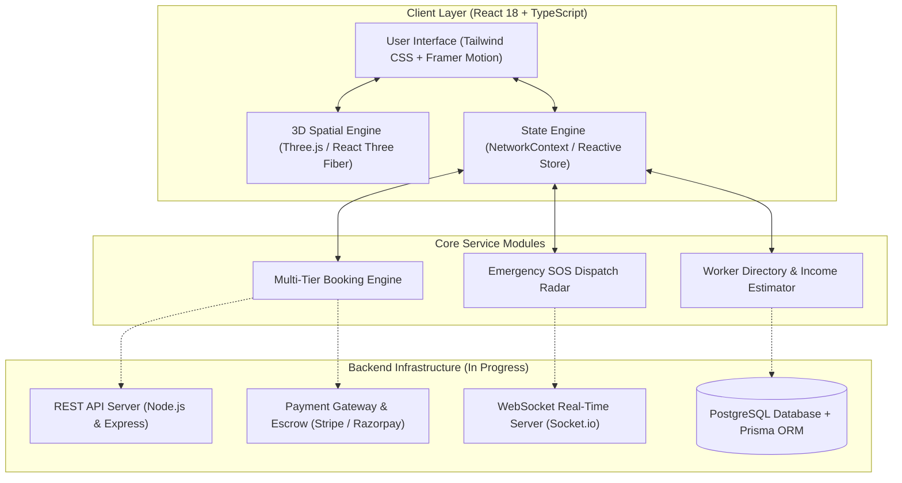
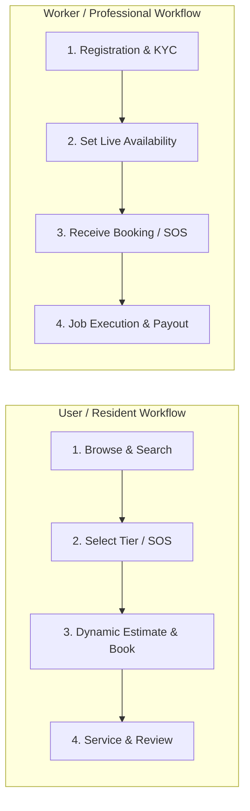

# MEGA PROJECT REPORT
## SMART NEIGHBORHOOD HELP NETWORK
### *A Next-Generation Hyperlocal Community Assistance & Emergency SOS Platform*

---

### **Project Details**
* **Project Title:** Smart Neighborhood Help Network
* **Project Type:** Final Year Mega Project
* **Academic Year:** 2025 – 2026
* **Domain:** Full-Stack Web Development, Spatial Computing (3D WebGL), Real-Time Distributed Systems

### **Project Team Members**
1. **Atharva Patil**
2. **Siddhi Pitambare**
3. **Rushikesh Kudalkar**
4. **Abhishek Ingale**

---

## TABLE OF CONTENTS
1. [Abstract](#1-abstract)
2. [Introduction & Background](#2-introduction--background)
3. [Problem Statement & Objectives](#3-problem-statement--objectives)
4. [Literature Survey & Existing Systems vs Proposed System](#4-literature-survey--existing-systems-vs-proposed-system)
5. [System Architecture & Data Flow](#5-system-architecture--data-flow)
6. [Operational Workflows](#6-operational-workflows)
   * 6.1 Resident / User Workflow
   * 6.2 Worker / Professional Workflow
7. [Implemented Features & Deliverables](#7-implemented-features--deliverables)
8. [Technology Stack & Software Requirements](#8-technology-stack--software-requirements)
9. [Project Progress Status (40% Completion)](#9-project-progress-status-40-completion)
10. [Future Scope & Remaining Roadmap](#10-future-scope--remaining-roadmap)
11. [Community & Economic Impact](#11-community--economic-impact)
12. [Conclusion](#12-conclusion)

---

## 1. ABSTRACT

In modern residential communities, finding reliable, background-verified local technicians (plumbers, electricians, appliance mechanics) and receiving immediate aid during household emergencies remains fragmented, inefficient, and opaque. Commercial aggregators impose steep commission fees, lack real-time proximity awareness, and fail to provide specialized emergency response protocols.

The **Smart Neighborhood Help Network** is an innovative hyperlocal web application designed to bridge the gap between neighborhood residents, skilled trade professionals, and emergency responders. Leveraging **3D Spatial Computing (Three.js / WebGL)**, the platform visualizes real-time technician availability on an interactive 3D digital twin map. The platform incorporates a **1-click Emergency SOS broadcast**, **multi-tier dynamic service booking**, and an **onboarding portal with an interactive earnings calculator for local workers**. Currently at **40% project completion (Functional Frontend & 3D MVP)**, this report outlines the system architecture, workflows, completed modules, and upcoming backend/database integration phases.

---

## 2. INTRODUCTION & BACKGROUND

Rapid urbanization has led to densely populated residential societies where residents frequently face domestic emergencies and maintenance challenges. Traditional methods—such as physical paper notice boards, unvetted word-of-mouth recommendations, and corporate aggregator applications—exhibit significant drawbacks:

1. **Lack of Trust & Safety:** Unvetted individuals entering households.
2. **Slow Emergency Response:** Delays during electrical short circuits, water leaks, or health emergencies.
3. **Economic Exploitation:** Traditional aggregator platforms take 20%–30% cuts from blue-collar technicians.

The Smart Neighborhood Help Network addresses these challenges by decentralizing local service discovery, giving communities direct, transparent, and spatial access to vetted professionals.

---

## 3. PROBLEM STATEMENT & OBJECTIVES

### 3.1 Problem Statement
> *"To design and develop a full-fledged, real-time, 3D spatial web application that facilitates instant discovery, transparent booking of verified hyperlocal trade services, and rapid 1-click Emergency SOS broadcast for residential communities without intermediary commission exploitation."*

### 3.2 Key Project Objectives
* **Spatial Proximity Awareness:** Provide a 3D digital twin of the neighborhood showing live worker status (Available, On-Job, Emergency).
* **Rapid Emergency SOS:** Deliver sub-15 minute emergency response dispatch to nearby certified professionals.
* **Transparent Multi-Tier Pricing:** Implement upfront, tiered pricing (Standard, Priority, Emergency) with zero hidden fees.
* **Empowering Skilled Labor:** Provide a dedicated portal for local technicians to manage schedules, track earnings, and build neighborhood reputation.

---

## 4. LITERATURE SURVEY & EXISTING SYSTEMS VS PROPOSED SYSTEM

| Feature / Metric | Traditional Directories (JustDial, YellowPages) | Commercial Aggregators (UrbanCompany, TaskRabbit) | Smart Neighborhood Help Network (Proposed) |
| :--- | :--- | :--- | :--- |
| **Real-time Spatial Awareness** | ❌ None (Static Lists) | ❌ Approximate Distance Only | ✅ **Interactive 3D WebGL Neighborhood Map** |
| **Emergency SOS Broadcast** | ❌ None | ❌ None | ✅ **1-Click Priority SOS Beacon** |
| **Worker Commission Fees** | High / Subscription Based | 20% – 30% Deductions | ✅ **Zero / Minimal Transparent Platform Fee** |
| **Verification & Trust** | ❌ Unverified listings | ⚠️ Centralized corporate checks | ✅ **Community KYC + Multi-tier Verification** |
| **Upfront Tiered Pricing** | ❌ Ambiguous quotes | ⚠️ Fixed flat rates | ✅ **Standard, Priority & Emergency Dynamic Tiers** |

---

## 5. SYSTEM ARCHITECTURE & DATA FLOW

The application follows a modular, client-server decoupled architecture designed for high responsiveness, real-time spatial updates, and strict type safety.



---

## 6. OPERATIONAL WORKFLOWS

The platform is designed with two distinct, parallel operational workflows:



### 6.1 Resident / User Workflow
1. **Browse & Search:** User opens the platform and explores the interactive 3D spatial neighborhood map or filters the directory by 8+ categories (Plumbing, Electrical, Carpentry, Appliances, etc.).
2. **Select Service Tier:** User selects from *Standard*, *Priority*, or triggers the *Emergency SOS* beacon.
3. **Confirm Booking:** User selects time slot, provides address/task description, receives an instant transparent cost estimate, and receives a unique booking code.
4. **Service Delivery & Review:** Verified worker executes the task; upon satisfactory completion, the resident submits a community rating and review.

### 6.2 Worker / Professional Workflow
1. **Registration & KYC:** Local tradesperson signs up, submits skill certifications, sets hourly rates, and defines service radius.
2. **Set Live Availability:** Worker toggles their active status (`Available`, `On-Job`, `Off-Duty`) which reflects in real time on the 3D map.
3. **Accept Bookings / SOS Alerts:** Worker receives instant notifications for standard appointments or high-priority Emergency SOS alerts.
4. **Job Execution & Payout:** Worker completes the job on-site, receives verified OTP sign-off, receives direct payment, and builds verified reputation.

---

## 7. IMPLEMENTED FEATURES & DELIVERABLES

The following functional modules are fully built and tested:

1. **3D Spatial Neighborhood Map:**
   * Custom WebGL 3D town scene with directional lighting, rotating buildings, and interactive pins.
   * Real-time hotspot markers displaying pro statuses (*Available*, *On-Job*, *Emergency*).
2. **Emergency SOS Alert System:**
   * Rapid emergency modal with 3D pulse wave radar visualizer.
   * Prioritized routing to the nearest active certified technicians for critical hazards.
3. **Multi-Tier Service Booking Engine:**
   * Full booking workflow with Standard, Priority, and Emergency pricing tiers.
   * Dynamic price calculation, slot selection, and unique reference code generation.
4. **Verified Professional Directory:**
   * Filterable directory across 8+ service categories with live distance and ratings.
5. **Worker Registration & Onboarding:**
   * Structured multi-field registration form for local tradespeople.
6. **Pro Income Calculator:**
   * Interactive dynamic calculator allowing technicians to model projected weekly, monthly, and annual earnings.

---

## 8. TECHNOLOGY STACK & SOFTWARE REQUIREMENTS

### 8.1 Software & Libraries Used
* **Frontend Core:** React 18, TypeScript, Vite, Modern ESModules
* **3D & Spatial Graphics:** Three.js, React Three Fiber (`@react-three/fiber`), React Three Drei (`@react-three/drei`)
* **Styling & Motion:** Tailwind CSS, Framer Motion, Lucide React Iconography
* **State Management:** React Context API, Custom Hooks, Reactive Stores
* **Backend & Database (In Active Development):** Node.js, Express, WebSockets (`socket.io`), PostgreSQL
* **Utilities & Tooling:** PostCSS, Autoprefixer, Canvas Confetti, PptxGenJS

---

## 9. PROJECT PROGRESS STATUS (40% COMPLETION)

The project is currently at **40% overall completion**, representing a complete, functional client-side MVP:

```
[████████████████░░░░░░░░░░░░░░░░░░░░░░░░] 40% OVERALL
```

### Detailed Subsystem Breakdown

| Subsystem / Module | Status | Progress (%) |
| :--- | :--- | :---: |
| **Frontend UI & Web Application Layouts** | Functional & Responsive | **75%** |
| **3D Spatial Neighborhood Scene (Three.js)** | Functional Prototype | **70%** |
| **Service Directory & Multi-Tier Booking Logic** | Client Logic Active | **60%** |
| **Emergency SOS Dispatch Beacon Module** | UI & State Engine Active | **50%** |
| **Backend REST APIs & Live WebSockets** | In Active Development | **20%** |
| **Database Schema & User Authentication** | In Design Phase | **15%** |
| **Payment Escrow & KYC Verification Gateway** | Upcoming Sprint Target | **10%** |

---

## 10. FUTURE SCOPE & REMAINING ROADMAP


* **Phase 1 (Immediate Sprint):** Deploy Node.js/Express REST server with Socket.io for live GPS worker tracking and real-time Emergency SOS broadcast.
* **Phase 2 (Upcoming Sprint):** Integrate PostgreSQL database using Prisma ORM with role-based JWT authentication (Resident, Verified Worker, Admin).
* **Phase 3 (Expansion Sprint):** Integrate Razorpay / Stripe payment gateway with digital escrow holding funds until homeowner OTP sign-off.
* **Phase 4 (Scale Sprint):** Progressive Web App (PWA) build with native mobile push notifications and offline emergency SMS fallback.

---

## 11. COMMUNITY & ECONOMIC IMPACT

1. **Hyperlocal Economic Growth:** Enables blue-collar tradespeople to acquire direct leads without paying 20%–30% platform commissions.
2. **Life Safety & Hazard Mitigation:** Sub-15 minute emergency response minimizes damage from electrical fires, gas leaks, and plumbing bursts.
3. **Community Trust & Cohesion:** Neighborhood-verified ratings and transparent credentials create safer residential environments.

---

## 12. CONCLUSION

The **Smart Neighborhood Help Network** successfully combines **3D spatial visualization**, **hyperlocal on-demand booking**, and **rapid emergency dispatch** into a unified web application. With the frontend client and 3D spatial interactive prototype fully developed (**40% overall project milestone**), subsequent development will focus on the real-time WebSocket backend, PostgreSQL database, and escrow payment integration to deliver a full-fledged production platform.

---

### **Project Team Sign-Off**
* **Atharva Patil**
* **Siddhi Pitambare**
* **Rushikesh Kudalkar**
* **Abhishek Ingale**

*Smart Neighborhood Help Network • Mega Project 2026*
